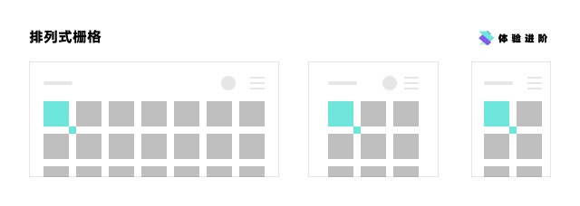
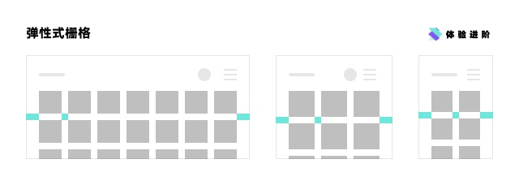
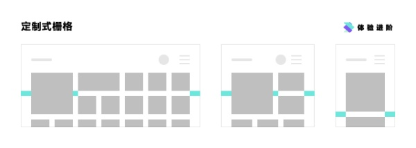

## 响应式方案总结
### 排列式栅格
顾名思义，这中栅格中，卡片（既内容区域）尺寸和间距不变，每行能放几张卡片就放几张，摆不下就换行，逻辑非常简单。

代表的有 google、youtube。这个栅格系统问题很明显：

- 页边距不确定，所以为了视觉平衡感，大多将列表居中
- 一整页最好只有一种尺寸的卡片，否则边距无法统一
- 固定的卡片尺寸和边距可能在大屏看起来太小，小屏看起来太大

### 弹性栅格

这种栅格系统的间距和页边距是固定的，卡片尺寸在一定程度下弹性伸缩，以确保填满整个屏幕。因为间距和页边距固定，也不用担心卡片混排。

代表的有 google drive、spotify，这个方式为了保证页边距不想第一种方式一样来回变动，不得不让卡片在一定范围内伸缩，这样的好处是，不同大小的卡片混排也不会造成混乱。但是在缩放浏览器时，你会发现卡片的尺寸不可避免的时大时小。

### 定制栅格

国内大部分网站并没有做响应式布局（知乎、淘宝、爱奇艺等），即便是部分做了（简书、京东、腾讯视频等）也大多没使用上面两种自适应方案，而是定制类响应式布局。

通常它的尺寸伸缩并不是依赖一套通用的规范，而是人为设计了几种尺寸。这个例子还算相对复杂了，如果你去看国内其它响应式界面，可能因为是人力设计，所以大多变化范围并不大，最大尺寸和最小尺寸之间的差别有限。

[摘抄]: https://www.zhihu.com/search?type=content&amp;q=%E5%A4%A7%E5%B1%8F%E5%93%8D%E5%BA%94%E5%BC%8F%E6%96%B9%E6%A1%88

## 方案汇总
### rem + 媒体查询
优势响应速度快，代码量小，但是 ie9 有部分兼容性问题
### 固定 class + 媒体查询
优势响应速度较快，基本兼容 ie8，虽然需要两套样式可是公共样式的代码量小，应对未知变化（2挡变3挡）的能力较强
### 可变容器方案，通过 js 监听视口，加载根容器对应视口下的 class （网易的方案）
 优势完全兼容 ie8， 不足需要维护两套样式，工作量较大，视口大小判断不够准确，对视口变化响应不及时，页面伸缩有卡顿，对未知（2挡方案变3挡）变化的能力差