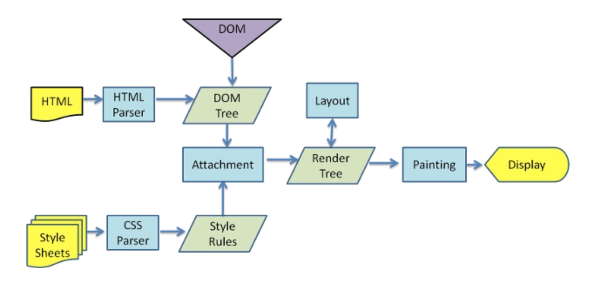

### 小常识
- 单线程是什么？
  同一时间只能做一件事
- 为什么js是单线程的？
  避免Dom渲染冲突
- 事件轮询是什么
  同步代码直接执行，异步函数先放在异步队列中，待所有同步函数执行完毕，轮询执行异步队列的函数
- promise 最早是从来个库演变过来的
  promise then 的写法最早是从jquery1.5之后 deferred 演变来的，只能从写法上杜绝了callback 这种形式，它是一种语法糖，但是解耦了代码。对扩展开放，对修改封闭

- css 加载会阻塞 dom 渲染吗？
  css 加载不会阻塞 dom 树解析，但是会阻塞 dom 树渲染，css加载会阻塞后面js语句的执行

  

- 浏览器渲染页面会执行那几个事件？
     
  DOMContentLoaded 和 onLoad 区别在于,load 应该仅用于检测一个完全加载的页面，当一个资源及其依赖资源已完成加载时，将触发load事件。而DOMContentLoaded事件被触发，无需等待样式表、图像和子框架的完成加载。意思是HTML下载、解析完毕之后就触发

    
- Webpack热更新实现原理？
  1. Webpack编译期，为需要热更新的 entry 注入热更新代码(EventSource通信)
  2. 页面首次打开后，服务端与客户端通过 EventSource 建立通信渠道，把下一次的 hash 返回前端
  3. 客户端获取到hash，这个hash将作为下一次请求服务端 hot-update.js 和 hot-update.json的hash
  4. 修改页面代码后，Webpack 监听到文件修改后，开始编译，编译完成后，发送 build 消息给客户端
  5. 客户端获取到hash，成功后客户端构造hot-update.js script链接，然后插入主文档
  6. hot-update.js 插入成功后，执行hotAPI 的 createRecord 和 reload方法，获取到 Vue 组件的 render方法，重新 render 组件， 继而实现 UI 无刷新更新。

- HTTP1.0 和 HTTP1.1的区别 ？
  HTTP1.0 默认是短连接，可以长连接，但是需要设置header connection :Keep_Alive。 HTTP1.1默认是长连接

- HTTP1.0、HTTP1.1 和 HTTP2.0 的区别
  1. HTTP2.0支持二进制传输数据，更加安全快捷，而HTTP1.0，HTTP1.1只支持文本
  2. HTTP2.0实现了多路复用，更加快捷
  3. HTTP2.0压缩了header
  4. HTTP2.0支持服务'主动'给客户端缓存发送数据

- TCP 和 UDP 的区别
  1. TCP 是面向链接的服务，而 UDP 是无连接的，既发送数据之前不需要简历链接
  2. TCP 提供可靠交付服务，无差错，不丢失，不重复，按时到达，而UDP提供尽力而为交付服务，不保证可靠交付
  3. TCP 面向字节流，而 UDP 面向报文
  4. TCP 具有拥塞控制，力求使每条 TCP 链接公平的享用网络资源。UDP 没有拥塞控制
  5. TCP 连接只能是点到点，而 UDP 支持一对一，一对多，多对一和多对多的交互通信
  6. TCP 首部开销20字节，UDP 首部开销8字节
  7. TCP 的逻辑通信信道是全双工可靠信道，而UDP是不可靠信道
