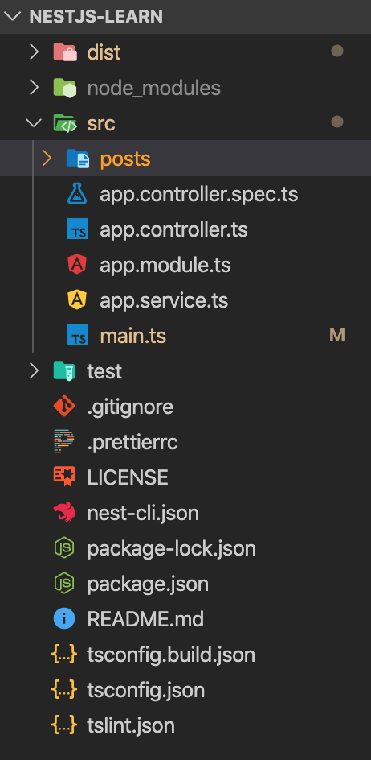

# Nestjs 入门

[nest官网地址](https://www.nestjs.com/)

### 安装

```bash
$ npm i -g @nestjs/cli
$ nest new project-name
```

### 目录结构



### 模块

###### `app.module.ts` 文件

```ts
import { Module } from '@nestjs/common';
import { AppController } from './app.controller';
import { AppService } from './app.service';
import { PostsModule } from './posts/posts.module';

@Module({
  imports: [PostsModule],
  controllers: [AppController],
  providers: [AppService],
})
export class AppModule {}
```

### 常用命令（mest -h）

创建模块：nest g mo posts

创建控制器：nest g co posts