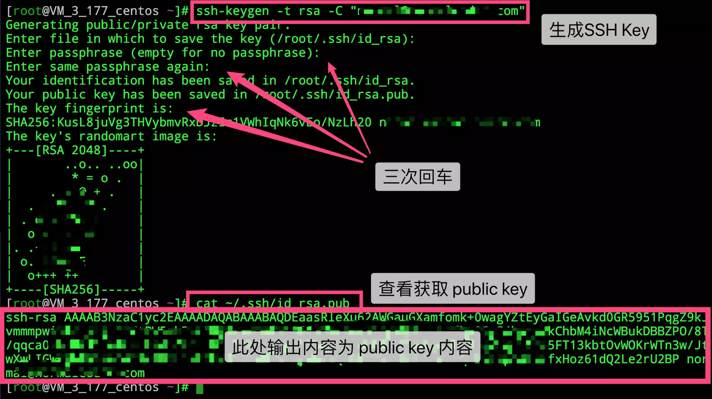

### Vue 项目开发套路

#### 项目初始化
1. 安装 `@vue/cli` 脚手架
    ```js
    npm install -g @vue/cli
    // 或者
    yarn global add @vue/cli
    ```
2. 通过 `Vue` 脚手架创建项目
    ```js
    vue create my-project
    # 或者
    vue ui
    ```
3. 配置 `Vue` 路由
4. 配置 `Element-UI` 组件库
5. 配置 `Axios` 库
6. 初始化 `git`远程仓库并托管到远端仓库
    ```js
    ssh-keygen -t rsa -C "xxxxx@xxxxx.com"  
    #Generating public/private rsa key pair...
    ```
    按照提示完成三次回车，即可生成 ssh key。通过查看 `~/.ssh/id_rsa.pub` 文件内容，获取到你的 public key
    `cat ~/.ssh/id_rsa.pub`
    
    复制ssh key然后 「管理」->「部署公钥管理」->「添加部署公钥」

    git 全局设置：
    ```js
    git config --global user.name "pdeng"
    git config --global user.email "635639654@qq.com"
    ```
    如果本地**已经有了**仓库：
    ```js
    cd existing_git_repo
    git remote add origin https://gitee.com/idenpin/vue-ui-test.git
    git push -u origin master
    ```
    创建 git 仓库：
    ```js
    mkdir vue-ui-test
    cd vue-ui-test
    git init
    touch README.md
    git add README.md
    git commit -m "first commit"
    git remote add origin https://gitee.com/idenpin/vue-ui-test.git
    git push -u origin master
    ```

#### 项目基本配置
1. `scss`项目全局配置
    安装 loader 
    ```js
    vue add style-resources-loader
    ```
    配置`vue.config.js`
    ```js
    ...
    pluginOptions: {
      'style-resources-loader': {
        preProcessor: 'scss',
        patterns: [path.resolve(__dirname, 'src/assets/style/_variables.scss')]
      }
    }
    ...
    ```

2. 项目配置`alias`
    `vue.config.js`文件添加如下配置

    ```js

    // 方案一
    ...
    configureWebpack: {
        resolve: {
            alias: {
                '@': path.join(__dirname, 'src'),
                '@@': path.join(__dirname, 'src/assets')
            }
        }
    }
    ...

    // 方案二
    chainWebpack (config) {
        ...
        config.resolve.alias
        .set('@', path.resolve('src'))
        .set('@@', path.resolve('src/assets'))
        ...
    }
    ```

3. 项目配置支持`iconfont`字体图标
    > 远古时代
    在我刚开始实习时，大部分图标都是用 `img` 来实现的。渐渐发现一个页面的请求资源中图片 img 占了大部分，所以为了优化有了image `sprite` 就是所谓的雪碧图，就是将多个图片合成一个图片，然后利用 `css` 的 `background-position` 定位显示不同的 `icon` 图标。但这个也有一个很大的痛点，维护困难。每新增一个图标，都需要改动原始图片，还可能不小心出错影响到前面定位好的图片，而且一修改雪碧图，图片缓存就失效了，久而久之你不知道该怎么维护了。
    `iconfont`
    一个阿里爸爸做的开源图库，不仅有几百个公司的开源图标库，还有各式各样的小图标，还支持自定义创建图标库，所以不管你是一家创业公司还是对设计很有要求的公司，它都能很好的帮助你解决管理图标的痛点。你想要的基本都有~

    ##### iconfont 三种姿势
   - `unicode`
    **优势**：兼容性最好、支持 ie6+，支持按字体的方式去动态调整大小、颜色等
    **劣势**：不支持多色图标，在不同设备浏览器字体渲染会略微有差别。其显示的位置和大小可能会受到font-size、line-height、word-spacing等CSS属性的影响，而且这种影响调整起来较为困难。unicode的书写不直观，语意不明确
    **使用方法**
        第一步：引入自定义字体`font-face`
        ```css
        @font-face {
            font-family: "iconfont";
            src: url('iconfont.eot'); /* IE9*/
            src: url('iconfont.eot#iefix') format('embedded-opentype'), /* IE6-IE8 */
            url('iconfont.woff') format('woff'), /* chrome, firefox */
            url('iconfont.ttf') format('truetype'), /* chrome, firefox, opera, Safari, Android, iOS 4.2+*/
            url('iconfont.svg#iconfont') format('svg'); /* iOS 4.1- */
        }
        ```
        第二步：定义使用`iconfont`的样式
        ```css
        .iconfont {
            font-family:"iconfont" !important;
            font-size:16px;
            font-style:normal;
            -webkit-font-smoothing: antialiased;
            -webkit-text-stroke-width: 0.2px;
            -moz-osx-font-smoothing: grayscale;
        }
        ```
        第三步：选择对应的图标获取字体编码
        ```html
        <i class="iconfont">&#xe604;</i>
        ```
   - `font-class`
   **优势**：支持ie8+，相比于`unicode`语义明确，书写直观
   **使用方法**
        第一步：拷贝项目下面生成的`fontclass`代码
        ```js
        ../font_8d5l8fzk5b87iudi.css
        ```
        第二步：挑选相应图标并获取类名，应用于页面
        ```html
        <i class="iconfont icon-xxx"></i>
        ```
        它的主要原理其实是和 unicode 一样的，它只是多做了一步，将原先&#xe604这种写法换成了.icon-QQ，它在每个 class 的 before 属性中写了unicode,省去了人为写的麻烦。如 .icon-QQ:before { content: "\e604"; }

        相对于unicode 它的修改更加的方便与直观。但也有一个大坑，之前楼主一个项目中用到了两组font-class 由于没有做好命名空间，所有的class都是放在.iconfont 命名空间下的，一上线引发了各种雪崩问题，修改了半天，所以使用font-class一定要注意命名空间的问题。

   - `symbol`
   随着万恶的某某浏览器逐渐淡出历史舞台，svg-icon 使用形式慢慢成为主流和推荐的方法。相关文章可以参考张鑫旭大大的文章未来必热：SVG Sprite技术介绍
   **优势**：
    支持多色图标了，不再受单色限制。
    支持像字体那样通过font-size,color来调整样式。
    支持 ie9+
    可利用CSS实现动画。
    减少HTTP请求。
    矢量，缩放不失真
    可以很精细的控制SVG图标的每一部分
    **使用方法**：
        第一步：拷贝项目下面生成的symbol代码
        ```js
        引入  ./iconfont.js
        ```
        第二步：加入通用css代码（引入一次就行）
        ```css
        <style type="text/css">
            .icon {
            width: 1em; height: 1em;
            vertical-align: -0.15em;
            fill: currentColor;
            overflow: hidden;
            }
        </style>
        ```
        第三步：挑选相应图标并获取类名，应用于页面
        ```html
        <svg class="icon" aria-hidden="true">
            <use xlink:href="#icon-xxx"></use>
        </svg>

        ```
        使用svg-icon的好处是我再也不用发送woff|eot|ttf| 这些很多个字体库请求了，我所有的svg都可以内联在html内。 svg 是一个真正的矢量，不管你再怎么的放缩它都不会失真模糊，而且svg可以控制的属性也更加的丰富，也能做出更加生动和复杂的图标。现在ui设计师平时都喜欢使用 sketch 来工作，只要轻松一键就能导出 svg 了，所以 svg 也更受设计师的青睐。